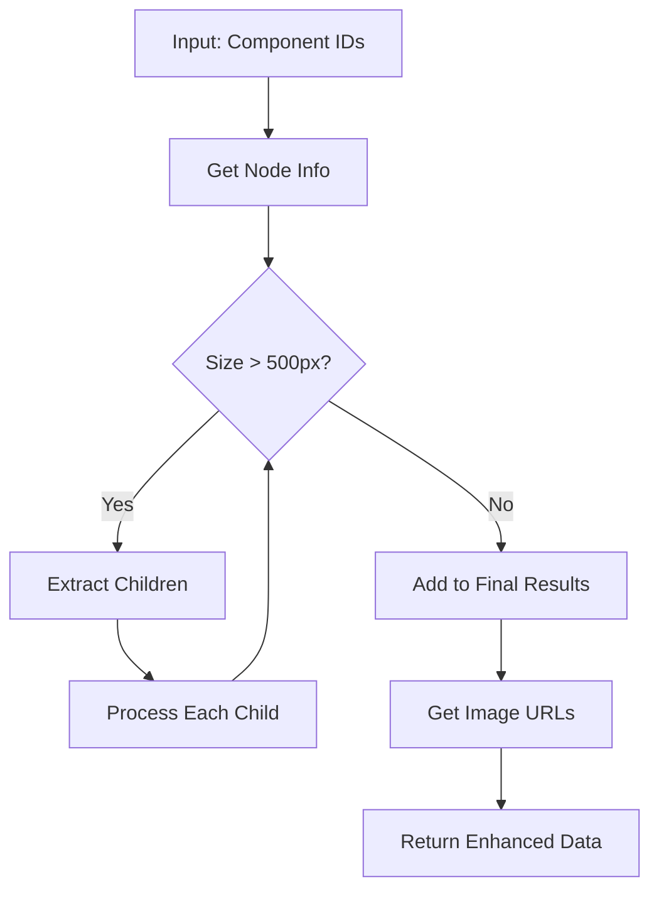

# 🎨 Figma Integration - Technical Deep Dive

## 🎯 Overview
Advanced Figma API integration with intelligent recursive component processing for automated image extraction.

## 🏗️ Architecture

### Core Components

```typescript
// Main Service Entry Point
FigmaService.getComponentImages()
├── getNodeInfo() - Fetch component dimensions & structure
├── processNodesRecursively() - Smart component decomposition  
├── getImageUrls() - Extract actual image URLs
└── Return enhanced FigmaImageDto[]
```

## 🧠 Intelligent Processing Logic

### Size-Based Component Decomposition

**Rule**: If component dimensions > 500px (width OR height) → Extract children instead

```typescript
// Decision Flow
if (width > 500 || height > 500) {
  → Get all children components
  → Process each child recursively
  → Continue until all components ≤ 500px
} else {
  → Use original component for image extraction
}
```

### Recursive Algorithm

```typescript
processNodeRecursively(nodeId) {
  node = getNodeInfo(nodeId)
  
  if (shouldUseChildren(node)) {
    children = collectChildrenIds(node)
    for (child in children) {
      processNodeRecursively(child) // 🔄 RECURSION
    }
  } else {
    finalResults.add(nodeId) // ✅ ADD TO FINAL LIST
  }
}
```

## 📊 Data Flow



## 💾 Enhanced Data Structure

### Input
```typescript
componentIds: ["189639:111814", "189639:111815"]
```

### Output
```typescript
FigmaImageDto[] = [
  {
    componentId: "189639:111815",
    imageUrl: "https://s3-alpha.figma.com/...",
    width: 60,
    height: 20
  },
  {
    componentId: "189639:111816", 
    imageUrl: "https://s3-alpha.figma.com/...",
    width: 10,
    height: 10
  }
]
```

## 🔧 Key Methods Deep Dive

### 1. `getNodeInfo()`
**Purpose**: Fetch component structure and dimensions from Figma API

```typescript
// API Call: GET /files/{fileId}/nodes?ids=...
// Returns: Node structure with absoluteBoundingBox
{
  nodes: {
    "componentId": {
      document: {
        id: "componentId",
        absoluteBoundingBox: { x, y, width, height },
        children: [...] // Nested structure
      }
    }
  }
}
```

### 2. `collectChildrenIds()`
**Purpose**: Recursively extract all child component IDs

```typescript
collectChildrenIds(node) {
  childrenIds = []
  for (child in node.children) {
    childrenIds.push(child.id)
    // 🔄 Recursive call for nested children
    childrenIds.push(...collectChildrenIds(child))
  }
  return childrenIds
}
```

### 3. `shouldUseChildren()`
**Purpose**: Decision logic for component decomposition

```typescript
shouldUseChildren(node) {
  if (!node.absoluteBoundingBox) return false
  
  const { width, height } = node.absoluteBoundingBox
  return width > 500 || height > 500 // 🎯 500px threshold
}
```

### 4. `getImageUrls()`
**Purpose**: Extract downloadable image URLs

```typescript
// API Call: GET /images/{fileId}?ids=...&format=png&scale=2
// Returns: Direct image URLs for download
{
  images: {
    "componentId": "https://s3-alpha.figma.com/image-url"
  }
}
```

## 🔍 Sample Figma Response Structure

### Node Structure (from figma_response.md)
```json
{
  "nodes": {
    "189639:111814": {
      "document": {
        "id": "189639:111814",
        "name": "Tag",
        "type": "FRAME",
        "absoluteBoundingBox": {
          "x": 10537,
          "y": 17288,
          "width": 76,
          "height": 22
        },
        "children": [
          {
            "id": "189639:111815",
            "name": "キャンセル",
            "type": "TEXT",
            "absoluteBoundingBox": {
              "x": 10545,
              "y": 17289,
              "width": 60,
              "height": 20
            }
          }
        ]
      }
    }
  }
}
```

## ⚡ Performance Optimizations

### 1. API Call Batching & Retry Logic
- Batch multiple component IDs in single API calls (max 10 per batch)
- **NEW**: Exponential backoff retry mechanism (2s, 4s, 8s delays)
- **NEW**: Intelligent error classification (retryable vs non-retryable)
- Cache node information to avoid duplicate requests
- Process children only when needed
- **NEW**: Rate limiting with 100ms delays between batches

### 2. Memory Management
- Use Set for deduplication
- Avoid circular references in recursive calls
- Clear temporary data structures
- **NEW**: Batch processing to prevent memory overload

### 3. Enhanced Error Handling
- **NEW**: Timeout increased from 30s to 60s for large operations
- **NEW**: Retry logic for timeout (ECONNABORTED), DNS (ENOTFOUND), rate limit (429), server errors (5xx)
- Graceful degradation for missing nodes
- Comprehensive logging for debugging
- **NEW**: Detailed error context with attempt tracking

## 🎛️ Configuration Options

### Current Settings
```typescript
// Size threshold for decomposition
const SIZE_THRESHOLD = 500; // pixels

// Image export settings
const DEFAULT_FORMAT = 'png';
const DEFAULT_SCALE = '2';
const API_TIMEOUT = 30000; // 30 seconds
```

### Customization Points
- **Size Threshold**: Adjustable per use case
- **Export Format**: png, jpg, svg, pdf
- **Scale Factor**: 1x, 2x, 4x for different resolutions
- **Component Types**: Filter by TEXT, VECTOR, FRAME, etc.

## 🔬 Testing Scenarios

### Scenario 1: Small Component (≤500px)
**Input**: Single small component
**Expected**: Original component returned
**Result**: No decomposition occurs

### Scenario 2: Large Component (>500px)
**Input**: Large frame with children
**Expected**: Children components returned instead
**Result**: Recursive decomposition until all ≤500px

### Scenario 3: Nested Large Components
**Input**: Large component with large children
**Expected**: Deep recursion until leaf components
**Result**: Multiple levels of decomposition

### Scenario 4: Mixed Sizes
**Input**: Array with both small and large components  
**Expected**: Small ones preserved, large ones decomposed
**Result**: Optimized component list

## 🚀 Usage Examples

### Basic Usage
```typescript
const images = await figmaService.getComponentImages(
  accessToken,
  fileId,
  ['component1', 'component2'],
  'png',
  '2'
);
```

### Advanced Processing Flow
```typescript
// 1. Input: Large component (800x600)
['large-component-id']

// 2. Processing: Decomposition occurs
// → Finds 3 children: ['child1', 'child2', 'child3']
// → Checks each child size
// → child2 is still large (600x400) → Further decomposition
// → Final: ['child1', 'child2a', 'child2b', 'child3']

// 3. Output: Multiple smaller, manageable components
[
  { componentId: 'child1', width: 200, height: 150, imageUrl: '...' },
  { componentId: 'child2a', width: 300, height: 200, imageUrl: '...' },
  { componentId: 'child2b', width: 250, height: 180, imageUrl: '...' },
  { componentId: 'child3', width: 100, height: 80, imageUrl: '...' }
]
```

---
*Implementation Date: Today*
*Status: Production Ready*
*Next Review: Performance optimization for large component trees*
