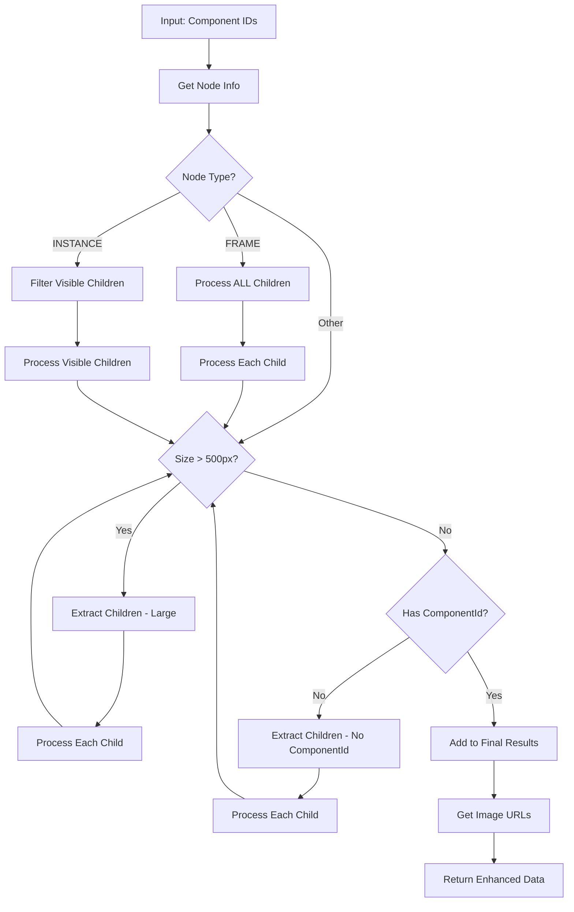

# 🎨 Figma Integration - Technical Deep Dive

## 🎯 Overview
Advanced Figma API integration with intelligent recursive component processing for automated image extraction.

## 🏗️ Architecture

### Core Components

```typescript
// Main Service Entry Point
FigmaService.getComponentImages()
├── getNodeInfo() - Fetch component dimensions & structure
├── processNodesRecursively() - Smart component decomposition  
├── getImageUrls() - Extract actual image URLs
└── Return enhanced FigmaImageDto[]
```

## 🧠 Intelligent Processing Logic

### 1. Type-Based Processing (NEW!)
**Rule**: Different processing logic based on node type

```typescript
// Type-Based Children Processing (Applied FIRST)
if (node.type === 'FRAME' && node.children) {
  allChildren = node.children.map(child => child.id)
  → Process ALL children directly (no visible filter)
} else if (node.type === 'INSTANCE' && node.children) {
  visibleChildren = node.children.filter(child => 
    child.type === 'INSTANCE' && child.visible !== false
  )
  → Process only visible INSTANCE children
} else {
  → Process node normally
}
```

**Use Case**: Phân biệt xử lý theo type để optimize processing
- **FRAME**: Container → process ALL children để tìm components
- **INSTANCE**: Component → chỉ process visible children để tránh hidden components

### 2. Size-Based Component Decomposition (Priority 1)

**Rule**: If component dimensions > 500px (width OR height) → Extract children instead

```typescript
// Priority 1: Size Check (Applied FIRST - tránh quá nhiều icon nhỏ)
if (width > 500 || height > 500) {
  → Get all children components
  → Process each child recursively
  → Continue until all components ≤ 500px
} else {
  → Component ≤ 500px → Check componentId
}
```

### 3. ComponentId-Based Processing (Priority 2)
**Rule**: Only for small components (≤500px) - if no componentId → Process children

```typescript
// Priority 2: ComponentId Check (Applied ONLY for small components)
if (component_is_small && !node.componentId) {
  → Process children instead (không thể generate image cho node không có componentId)
  → Continue recursively until find nodes with componentId
} else if (component_is_small && node.componentId) {
  → Use original component for image extraction ✅
}
```

### 4. Enhanced Recursive Algorithm

```typescript
processNodesRecursively(componentIds) {
  for (componentId of componentIds) {
    node = getNodeInfo(componentId)
    
    if (node.children) {
      if (node.type === 'FRAME') {
        // 🎯 FRAME: Process ALL children (no visible filter)
        allChildren = node.children.map(child => child.id)
        for (childId of allChildren) {
          processNodeRecursively(childId) // 🔄 RECURSION
        }
      } else if (node.type === 'INSTANCE') {
        // 🎯 INSTANCE: Filter visible children only
        visibleChildren = filterVisibleInstances(node)
        for (visibleId of visibleChildren) {
          processNodeRecursively(visibleId) // 🔄 RECURSION
        }
      } else {
        // Other types: process normally
        processNodeRecursively(componentId)
      }
    } else {
      processNodeRecursively(componentId)
    }
  }
}

processNodeRecursively(nodeId) {
  node = getNodeInfo(nodeId)
  
  // 🚨 PRIORITY 1: Size check first (tránh quá nhiều icon nhỏ)
  if (shouldUseChildren(node)) {
    // Node quá lớn → process children
    children = collectChildrenIds(node)
    for (child in children) {
      processNodeRecursively(child) // 🔄 RECURSION
    }
  } else {
    // 🚨 PRIORITY 2: Node nhỏ (≤500px) → check componentId
    hasComponentId = !!(node.componentId)
    
    if (!hasComponentId) {
      // Node nhỏ nhưng không có componentId → process children
      children = collectChildrenIds(node)
      for (child in children) {
        processNodeRecursively(child) // 🔄 RECURSION
      }
    } else {
      finalResults.add(nodeId) // ✅ Node nhỏ VÀ có componentId
    }
  }
}
```

## 📊 Enhanced Data Flow



### Flow Explanation:
1. **NEW Step**: Check node type (FRAME vs INSTANCE vs Other)
2. **NEW Step**: 
   - FRAME → Process ALL children (no filtering)
   - INSTANCE → Filter visible children only
   - Other → Continue to priority logic
3. **PRIORITY 1**: Size-based decomposition (tránh quá nhiều icon nhỏ)
4. **PRIORITY 2**: ComponentId check (chỉ cho small components)
5. **Existing**: Recursive processing until optimal components found

## 💾 Enhanced Data Structure

### Input
```typescript
componentIds: ["189639:111814", "189639:111815"]
```

### Output
```typescript
FigmaImageDto[] = [
  {
    componentId: "189639:111815",
    imageUrl: "https://s3-alpha.figma.com/...",
    width: 60,
    height: 20
  },
  {
    componentId: "189639:111816", 
    imageUrl: "https://s3-alpha.figma.com/...",
    width: 10,
    height: 10
  }
]
```

## 🔧 Key Methods Deep Dive

### 1. `filterVisibleInstances()` (NEW!)
**Purpose**: Filter frame children to only get visible INSTANCE components

```typescript
// Input: Frame node with children
// Output: Array of visible instance IDs
filterVisibleInstances(frameNode: FigmaNode): string[] {
  if (!frameNode.children) return []
  
  const visibleInstances = frameNode.children.filter(child => {
    const isInstance = child.type === 'INSTANCE'
    const isVisible = child.visible !== false // undefined = visible
    return isInstance && isVisible
  })
  
  return visibleInstances.map(instance => instance.id)
}
```

**Real Example (Figma Frame 197382:116850):**
```typescript
// Input Frame has:
// - componentSets: 3 items (Button, Tag, Icon-Wrapper)  
// - components: 5 items (variants + individual icons)
// - document.children: 2 visible instances

// Filter Result: ["197382:116851", "197382:116852"]
// → Only 2 components user actually sees on canvas
```

### 2. `getNodeInfo()`
**Purpose**: Fetch component structure and dimensions from Figma API

```typescript
// API Call: GET /files/{fileId}/nodes?ids=...
// Returns: Node structure with absoluteBoundingBox
{
  nodes: {
    "componentId": {
      document: {
        id: "componentId",
        absoluteBoundingBox: { x, y, width, height },
        children: [...] // Nested structure
      }
    }
  }
}
```

### 2. `collectChildrenIds()`
**Purpose**: Recursively extract all child component IDs

```typescript
collectChildrenIds(node) {
  childrenIds = []
  for (child in node.children) {
    childrenIds.push(child.id)
    // 🔄 Recursive call for nested children
    childrenIds.push(...collectChildrenIds(child))
  }
  return childrenIds
}
```

### 3. `shouldUseChildren()`
**Purpose**: Decision logic for component decomposition

```typescript
shouldUseChildren(node) {
  if (!node.absoluteBoundingBox) return false
  
  const { width, height } = node.absoluteBoundingBox
  return width > 500 || height > 500 // 🎯 500px threshold
}
```

### 4. `getImageUrls()`
**Purpose**: Extract downloadable image URLs

```typescript
// API Call: GET /images/{fileId}?ids=...&format=png&scale=2
// Returns: Direct image URLs for download
{
  images: {
    "componentId": "https://s3-alpha.figma.com/image-url"
  }
}
```

## 🔍 Sample Figma Response Structure

### Node Structure (from figma_response.md)
```json
{
  "nodes": {
    "189639:111814": {
      "document": {
        "id": "189639:111814",
        "name": "Tag",
        "type": "FRAME",
        "absoluteBoundingBox": {
          "x": 10537,
          "y": 17288,
          "width": 76,
          "height": 22
        },
        "children": [
          {
            "id": "189639:111815",
            "name": "キャンセル",
            "type": "TEXT",
            "absoluteBoundingBox": {
              "x": 10545,
              "y": 17289,
              "width": 60,
              "height": 20
            }
          }
        ]
      }
    }
  }
}
```

## ⚡ Performance Optimizations

### 1. API Call Batching & Retry Logic
- Batch multiple component IDs in single API calls (max 10 per batch)
- **NEW**: Exponential backoff retry mechanism (2s, 4s, 8s delays)
- **NEW**: Intelligent error classification (retryable vs non-retryable)
- Cache node information to avoid duplicate requests
- Process children only when needed
- **NEW**: Rate limiting with 100ms delays between batches

### 2. Memory Management
- Use Set for deduplication
- Avoid circular references in recursive calls
- Clear temporary data structures
- **NEW**: Batch processing to prevent memory overload

### 3. Enhanced Error Handling
- **NEW**: Timeout increased from 30s to 60s for large operations
- **NEW**: Retry logic for timeout (ECONNABORTED), DNS (ENOTFOUND), rate limit (429), server errors (5xx)
- Graceful degradation for missing nodes
- Comprehensive logging for debugging
- **NEW**: Detailed error context with attempt tracking

## 🎛️ Configuration Options

### Current Settings
```typescript
// Size threshold for decomposition
const SIZE_THRESHOLD = 500; // pixels

// Image export settings
const DEFAULT_FORMAT = 'png';
const DEFAULT_SCALE = '2';
const API_TIMEOUT = 30000; // 30 seconds
```

### Customization Points
- **Size Threshold**: Adjustable per use case
- **Export Format**: png, jpg, svg, pdf
- **Scale Factor**: 1x, 2x, 4x for different resolutions
- **Component Types**: Filter by TEXT, VECTOR, FRAME, etc.

## 🔬 Testing Scenarios

### Scenario 1: FRAME with All Children (NEW!)
**Input**: FRAME node with multiple children components
**Expected**: ALL children processed directly (no visible filtering)
**Result**: All children IDs processed regardless of visible/type status

### Scenario 2: INSTANCE with Visible/Hidden Children (NEW!)
**Input**: INSTANCE node with mixed visible/hidden children
**Expected**: Only visible INSTANCE children processed
**Result**: Hidden children filtered out, only visible ones processed

### Scenario 3: Mixed Node Types Processing (NEW!)
**Input**: Array with FRAME, INSTANCE, and other types
**Expected**: Each type follows its specific logic
**Result**: FRAME → all children, INSTANCE → visible children, Others → normal logic

### Scenario 2.1: Small Node without ComponentId (NEW!)
**Input**: Node nhỏ (≤500px) không có componentId property 
**Expected**: Process children instead of current node (chỉ khi node đã nhỏ)
**Result**: Children được xử lý recursively cho đến khi tìm được nodes có componentId

### Scenario 2.2: Large Node without ComponentId (Priority Logic)
**Input**: Node lớn (>500px) không có componentId property
**Expected**: Process children vì size priority (không care componentId)
**Result**: Size check được ưu tiên, children được process bình thường

### Scenario 3: Small Component (≤500px)
**Input**: Single small component
**Expected**: Original component returned
**Result**: No decomposition occurs

### Scenario 4: Large Component (>500px)
**Input**: Large frame with children
**Expected**: Children components returned instead
**Result**: Recursive decomposition until all ≤500px

### Scenario 5: Nested Large Components
**Input**: Large component with large children
**Expected**: Deep recursion until leaf components
**Result**: Multiple levels of decomposition

### Scenario 6: Mixed Sizes with Visible Filter
**Input**: Frame with mixed visible/hidden and various sizes
**Expected**: Only visible instances processed, then size-based decomposition applied
**Result**: Optimized visible component list

## 🚀 Usage Examples

### Basic Usage
```typescript
const images = await figmaService.getComponentImages(
  accessToken,
  fileId,
  ['component1', 'component2'],
  'png',
  '2'
);
```

### Type-Based Processing Flow (NEW!)

#### **FRAME Processing:**
```typescript
// 1. Input: FRAME ID với multiple children
['frame-id'] // FRAME containing various components

// 2. Processing: FRAME type detected → Process ALL children directly
// → NO FILTERING: All children.map(child => child.id)
// → Process: ['child1', 'child2', 'child3', 'child4'] (tất cả children)

// 3. Output: All children processed với individual priority logic
[
  { componentId: 'child1', name: 'Component1', imageUrl: '...' },
  { componentId: 'child2', name: 'Component2', imageUrl: '...' },
  { componentId: 'child3', name: 'Component3', imageUrl: '...' }
]
```

#### **INSTANCE Processing:**
```typescript
// 1. Input: INSTANCE ID với visible/hidden children
['instance-id'] // INSTANCE with mixed children

// 2. Processing: INSTANCE type detected → Filter visible children only
// → FILTERING APPLIED: filterVisibleInstances(node)
// → children: [visible=true, visible=false, visible=undefined]
// → filtered: [visible=true, visible=undefined] (visible=false excluded)

// 3. Output: Only visible children processed
[
  { componentId: 'visible-child1', name: 'VisibleComponent1', imageUrl: '...' },
  { componentId: 'visible-child3', name: 'VisibleComponent3', imageUrl: '...' }
  // hidden children excluded
]
```

### ComponentId Processing Flow (NEW!)
```typescript
// 1. Input: Node không có componentId (container/group node)
['container-node-id'] // Node chỉ là wrapper, không có componentId

// 2. Processing: ComponentId check applied
// → getNodeInfo(container-node-id) → { id: '...', componentId: undefined }
// → Check: !node.componentId → true
// → Action: Process children instead of current node

// 3. Children Processing: 
// → collectChildrenIds(node) → ['child1', 'child2', 'child3']
// → Process each child recursively
// → Continue until find nodes có componentId để có thể generate images

// 4. Final Result: Chỉ nodes có componentId
[
  { componentId: 'child1', imageUrl: '...', width: 100, height: 50 },
  { componentId: 'child3', imageUrl: '...', width: 80, height: 40 }
  // child2 không có componentId nên children của nó được process
]
```

### Advanced Processing Flow
```typescript
// 1. Input: Large component (800x600)
['large-component-id']

// 2. Processing: Decomposition occurs
// → Finds 3 children: ['child1', 'child2', 'child3']
// → Checks each child size
// → child2 is still large (600x400) → Further decomposition
// → Final: ['child1', 'child2a', 'child2b', 'child3']

// 3. Output: Multiple smaller, manageable components
[
  { componentId: 'child1', width: 200, height: 150, imageUrl: '...' },
  { componentId: 'child2a', width: 300, height: 200, imageUrl: '...' },
  { componentId: 'child2b', width: 250, height: 180, imageUrl: '...' },
  { componentId: 'child3', width: 100, height: 80, imageUrl: '...' }
]
```

---
*Implementation Date: Today*
*Status: Production Ready*
*Next Review: Performance optimization for large component trees*
