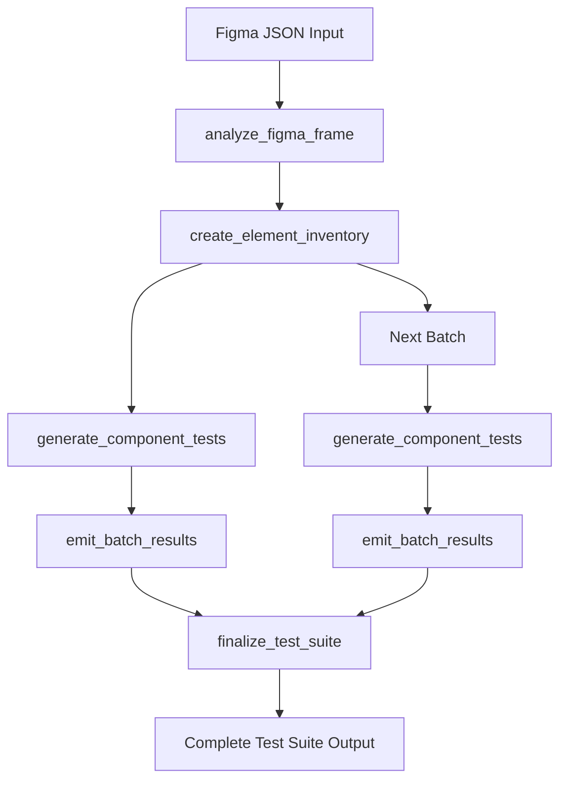

# 🧪 Test Case Generation API - Function-Based Testing Automation

## 🎯 Overview
Advanced AI-powered test case generation using **Function-Based Tools Approach** for systematic component analysis. Features include Software Requirements Specification (SRS) analysis with OpenAI function calling for enhanced UI testing from Figma components.

### 🆕 **Function-Based Tools v3.0**
- ✅ **Systematic Component Analysis** using OpenAI function calling
- ✅ **Elimination of Hallucinations** through tool-enforced element grounding
- ✅ **Batch Processing** for large Figma designs (max 10 components per batch)
- ✅ **Progressive Result Emission** for real-time monitoring
- ✅ **Enhanced Quality Control** with structured workflow

---

## 🔧 Function-Based Tools Workflow

The new v3.0 uses a systematic 5-phase approach with OpenAI function calling:



### Tools Used Internally:
1. **`analyze_figma_frame(frameId)`** - Discover all components
2. **`create_element_inventory(componentIds)`** - Create detailed EI (max 10 components)
3. **`generate_component_tests(batchId, elementInventory, testTypes)`** - Generate tests per batch
4. **`emit_batch_results(batchId, testCases)`** - Progressive result emission
5. **`finalize_test_suite(allBatches)`** - Final organization

> **Note**: These tools are used internally by the AI. API users don't call them directly.

---

## 🚀 Quick Start

### **Basic Test Case Generation**
```javascript
// Generate test cases from SRS description
const response = await fetch('/api/images/test-case-generation/generate', {
  method: 'POST',
  headers: { 'Content-Type': 'application/json' },
  body: JSON.stringify({
    srsDescription: `
      User Login Functionality:
      - Users can log in with email and password
      - System validates credentials against database
      - Failed attempts are logged
      - Users are redirected to dashboard on success
    `,
    projectName: 'E-commerce Platform',
    testingFramework: 'cypress'
  })
});

const result = await response.json();
console.log(`Generated ${result.data.testCases.length} test cases`);
```

### **UI Test Case Generation with Figma**
```javascript
// Generate test cases with UI testing from Figma component
const response = await fetch('/api/images/test-case-generation/generate', {
  method: 'POST',
  headers: { 'Content-Type': 'application/json' },
  body: JSON.stringify({
    srsDescription: 'Login form with email, password fields and submit button',
    includeUITests: true,
    figmaResponse: {
      id: "189639:111814",
      name: "Login Form",
      type: "FRAME",
      absoluteBoundingBox: { x: 0, y: 0, width: 400, height: 300 },
      children: [
        {
          id: "189639:111815",
          name: "Email Input",
          type: "FRAME"
        },
        {
          id: "189639:111816", 
          name: "Password Input",
          type: "FRAME"
        },
        {
          id: "189639:111817",
          name: "Login Button",
          type: "FRAME"
        }
      ]
    },
    projectName: 'Web App',
    testingFramework: 'playwright',
    model: 'gpt-4o'
  })
});
```

---

## 📋 API Endpoints

### **1. Generate Test Cases**
**Endpoint**: `POST /api/images/test-case-generation/generate`

**Request Body**:
```typescript
{
  srsDescription?: string;             // Optional: SRS description to analyze
  includeUITests?: boolean;            // Optional: Generate UI test cases (default: false)
  figmaResponse?: object;              // Required if includeUITests is true
  projectName?: string;                // Optional: Project context
  testingFramework?: TestingFramework; // Optional: Target framework (default: manual)
  model?: OpenAIModel;                 // Optional: AI model (default: gpt-4o-mini)
  additionalRequirements?: string;     // Optional: Custom requirements
}
```

**Response**:
```typescript
{
  success: boolean;
  data?: {
    testCases: TestCase[];             // Array of generated test cases
    groupedByCategory?: Record<string, TestCase[]>; // NEW: grouped for copy
    summary: TestSummary;              // Statistical summary (simplified)
    projectName?: string;              // Project name used
    generatedAt: string;               // Generation timestamp
    model: string;                     // AI model used
  };
  message?: string;                    // Success/error message
  processingTime?: number;             // Generation time in ms
  openaiUsage?: {                      // Cost tracking
    promptTokens: number;
    completionTokens: number;
    totalTokens: number;
    cost: number;                      // USD cost
  };
}
```

### Language & Localization
- Default output language is English (server default).
- Set `language` in the request body to force output (e.g., 'vi' for Vietnamese, 'ja' for Japanese).

### **2. Get Generation Options**
**Endpoint**: `GET /api/images/test-case-generation/options`

**Response**:
```typescript
{
  success: boolean;
  data: {
    models: OpenAIModel[];             // Available AI models
    testingFrameworks: TestingFramework[]; // Supported frameworks
    categories: TestCaseCategory[];    // Test categories
    priorities: TestCasePriority[];    // Priority levels
    types: TestCaseType[];             // Test types
    defaultOptions: {
      model: 'gpt-4o-mini';           // Default cost-effective model
      includeUITests: false;          // Default: functional tests only
      testingFramework: 'manual';     // Default: manual testing
    };
    modelInfo: Array<{                // Detailed model information
      model: string;
      description: string;
      maxTokens: number;
      costPer1K: { input: number; output: number };
      recommended: boolean;
      category: string;
      features: string[];
    }>;
  };
}
```

### **3. Get Generation Statistics**
**Endpoint**: `GET /api/images/test-case-generation/stats`

### **4. Health Check**
**Endpoint**: `GET /api/images/test-case-generation/health`

---

## 📊 Data Structures

### **TestCase Object**
```typescript
{
  id: string;                         // Unique identifier
  title: string;                      // Descriptive title
  description: string;                // What is being tested
  category: TestCaseCategory;         // functional | ui_ux | integration | etc.
  priority: TestCasePriority;         // critical | high | medium | low
  type: TestCaseType;                 // positive | negative | boundary | exploratory
  preconditions?: string[];           // Prerequisites
  steps: TestStep[];                  // Detailed test steps
  expectedResult: string;             // Expected outcome
  tags?: string[];                    // Categorization tags
  estimatedTime?: number;             // Execution time in minutes
  uiElements?: UITestElement[];       // UI-specific elements (if UI tests enabled)
}
```

### **TestStep Object**
```typescript
{
  stepNumber: number;                 // Step sequence
  action: string;                     // What to do
  expectedBehavior?: string;          // Expected response
  testData?: string;                  // Test data to use
  uiInteraction?: UIInteraction;      // UI-specific interaction
}
```

### **UITestElement Object** (UI Tests Only)
```typescript
{
  elementName: string;                // Element identifier
  elementType: string;                // button | input | text | etc.
  selector?: string;                  // CSS selector or test ID
  figmaId?: string;                   // Reference to Figma component
  properties?: Record<string, any>;   // Visual properties
}
```

### **TestSummary Object**
```typescript
{
  totalTestCases: number;             // Total generated
  byCategory: {                       // Simplified per-category counts
    functional: number;
    ui_ux: number;
    integration: number;
    edge_case: number;
    performance: number;
    security: number;
    regression: number;
    accessibility: number;
  };
}
```

---

## 🎯 Testing Framework Support

### **Manual Testing (Default)**
```javascript
{
  testingFramework: 'manual',
  // Generates human-readable test cases with clear steps
}
```

### **Cypress E2E Testing**
```javascript
{
  testingFramework: 'cypress',
  // Generates test cases optimized for Cypress patterns
  // Includes page object model references
  // Command chaining considerations
}
```

### **Playwright Testing**
```javascript
{
  testingFramework: 'playwright',
  // Multi-browser testing scenarios
  // Screenshot and visual comparisons
  // Network and API mocking patterns
}
```

### **Jest Unit Testing**
```javascript
{
  testingFramework: 'jest',
  // describe/it structure patterns
  // Mock and spy requirements
  // Async/await testing patterns
}
```

### **Testing Library**
```javascript
{
  testingFramework: 'testing_library',
  // User-centric test approaches
  // Accessibility-first element selection
  // Screen reader compatibility
}
```

---

## 🤖 AI Model Selection Guide

### **Model Recommendations by Use Case**

| Use Case | Model | Context | Cost (est.) | Quality | Speed |
|----------|-------|---------|-------------|---------|--------|
| **🚀 Production Test Suites** | `gpt-4o` | 4K | $0.02-0.04 | ⭐⭐⭐⭐⭐ | ⭐⭐⭐⭐ |
| **💰 Bulk Test Generation** | `gpt-4o-mini` | 16K | $0.001-0.003 | ⭐⭐⭐⭐ | ⭐⭐⭐⭐⭐ |
| **🔥 Complex SRS Analysis** | `gpt-4.1` | 200K | $0.05-0.15 | ⭐⭐⭐⭐⭐ | ⭐⭐⭐ |
| **💎 Large SRS Budget** | `gpt-4.1-mini` | 128K | $0.01-0.05 | ⭐⭐⭐⭐ | ⭐⭐⭐⭐ |
| **⚡ Complex Logic Testing** | `gpt-4-turbo` | 4K | $0.04-0.08 | ⭐⭐⭐⭐⭐ | ⭐⭐⭐ |
| **🏷️ Budget Projects** | `gpt-3.5-turbo` | 4K | $0.002-0.006 | ⭐⭐⭐ | ⭐⭐⭐⭐⭐ |

### **Model Selection Examples**
```javascript
// High-quality comprehensive test suite
const productionRequest = {
  srsDescription: complexSRS,
  model: 'gpt-4o',
  includeUITests: true,
  testingFramework: 'playwright'
};

// Large SRS document analysis
const complexRequest = {
  srsDescription: largeSRSDocument,
  model: 'gpt-4.1',
  projectName: 'Enterprise System',
  additionalRequirements: 'Include security and performance tests'
};

// Cost-effective bulk generation
const bulkRequest = {
  srsDescription: basicSRS,
  model: 'gpt-4o-mini',
  testingFramework: 'manual'
};
```

---

## 🎨 UI Testing Integration

### **When UI Tests are Enabled**
```javascript
{
  includeUITests: true,
  figmaResponse: { /* Figma component data */ }
}
```

**Generated UI test cases include**:
- Element visibility and positioning validation
- Interactive behavior testing (clicks, inputs, hovers)
- Visual state verification
- Responsive design testing
- Accessibility compliance checks

### **UI Test Elements Mapping**
```javascript
// Example UI test case with Figma integration
{
  "id": "ui-test-001",
  "title": "Login Form Element Interactions",
  "category": "ui_ux",
  "steps": [
    {
      "stepNumber": 1,
      "action": "Verify email input field is visible",
      "uiInteraction": {
        "action": "verify",
        "target": "#email-input",
        "expectedVisualState": "visible and enabled"
      }
    },
    {
      "stepNumber": 2,
      "action": "Enter valid email address",
      "testData": "user@example.com",
      "uiInteraction": {
        "action": "type",
        "target": "#email-input",
        "value": "user@example.com"
      }
    }
  ],
  "uiElements": [
    {
      "elementName": "Email Input",
      "elementType": "input",
      "selector": "#email-input",
      "figmaId": "189639:111815",
      "properties": {
        "width": 300,
        "height": 40,
        "type": "email"
      }
    }
  ]
}
```

---

## 📈 Best Practices

### **1. SRS Description Guidelines**
```javascript
// ✅ Good: Clear, structured SRS
const goodSRS = `
User Authentication System:

Functional Requirements:
1. Users must register with email and password
2. Password must meet complexity requirements (8+ chars, special chars)
3. Email verification required before account activation
4. Failed login attempts are tracked (max 3 attempts)
5. Account lockout after 3 failed attempts
6. Password reset via email link

Non-Functional Requirements:
- Response time: < 2 seconds
- Security: All passwords hashed with bcrypt
- Availability: 99.9% uptime
`;

// ❌ Poor: Vague, unstructured description
const poorSRS = "Make a login system that works";
```

### **2. Error Handling**
```javascript
async function generateTestCases(srsDescription, options = {}) {
  try {
    const response = await fetch('/api/images/test-case-generation/generate', {
      method: 'POST',
      headers: { 'Content-Type': 'application/json' },
      body: JSON.stringify({
        srsDescription,
        ...options
      })
    });
    
    const result = await response.json();
    
    if (!result.success) {
      throw new Error(result.message || 'Test case generation failed');
    }
    
    return result;
    
  } catch (error) {
    console.error('Test case generation error:', error);
    
    // Handle specific error types
    if (error.message.includes('SRS description')) {
      return { success: false, error: 'INVALID_SRS', message: error.message };
    }
    
    if (error.message.includes('Figma response')) {
      return { success: false, error: 'INVALID_FIGMA', message: error.message };
    }
    
    return { success: false, error: 'UNKNOWN', message: error.message };
  }
}
```

### **3. Cost Optimization**
```javascript
// Monitor and optimize costs
class TestCaseGenerationTracker {
  constructor() {
    this.dailyCost = 0;
    this.totalGenerations = 0;
  }
  
  trackGeneration(result) {
    if (result.success && result.openaiUsage?.cost) {
      this.dailyCost += result.openaiUsage.cost;
      this.totalGenerations++;
      
      // Alert if approaching budget
      if (this.dailyCost > 20) { // $20 daily limit
        console.warn('Daily test generation cost exceeding budget!');
      }
    }
  }
  
  getStats() {
    return {
      dailyCost: this.dailyCost,
      averageCostPerGeneration: this.dailyCost / this.totalGenerations,
      totalGenerations: this.totalGenerations
    };
  }
}
```

---

## 🔧 Integration Examples

### **React Hook for Test Generation**
```typescript
import { useState, useCallback } from 'react';

export function useTestCaseGeneration() {
  const [loading, setLoading] = useState(false);
  const [error, setError] = useState<string | null>(null);
  const [testCases, setTestCases] = useState<TestCase[]>([]);

  const generateTestCases = useCallback(async (
    srsDescription?: string, 
    options: GenerationOptions = {}
  ) => {
    setLoading(true);
    setError(null);
    
    try {
      const response = await fetch('/api/images/test-case-generation/generate', {
        method: 'POST',
        headers: { 'Content-Type': 'application/json' },
        body: JSON.stringify({
          srsDescription,
          model: 'gpt-4o-mini',        // Cost-effective default
          testingFramework: 'manual',   // Default manual
          ...options
        })
      });
      
      const result = await response.json();
      
      if (!result.success) {
        throw new Error(result.message);
      }
      
      setTestCases(result.data.testCases);
      return result;
      
    } catch (err) {
      const errorMessage = err instanceof Error ? err.message : 'Unknown error';
      setError(errorMessage);
      throw err;
    } finally {
      setLoading(false);
    }
  }, []);

  return {
    generateTestCases,
    testCases,
    loading,
    error,
    clearError: () => setError(null)
  };
}
```

### **Vue Composable Example**
```typescript
import { ref, reactive } from 'vue';

export function useTestCaseGeneration() {
  const loading = ref(false);
  const error = ref<string | null>(null);
  const testCases = ref<TestCase[]>([]);

  const generateTestCases = async (srsDescription?: string, options = {}) => {
    loading.value = true;
    error.value = null;
    
    try {
      const response = await fetch('/api/images/test-case-generation/generate', {
        method: 'POST',
        headers: { 'Content-Type': 'application/json' },
        body: JSON.stringify({
          srsDescription,
          model: 'gpt-4o-mini',
          testingFramework: 'manual',
          ...options
        })
      });
      
      const result = await response.json();
      
      if (!result.success) {
        throw new Error(result.message);
      }
      
      testCases.value = result.data.testCases;
      return result;
      
    } catch (err) {
      error.value = err.message || 'Unknown error';
      throw err;
    } finally {
      loading.value = false;
    }
  };

  return {
    generateTestCases,
    testCases: readonly(testCases),
    loading: readonly(loading),
    error: readonly(error)
  };
}
```

---

## 🎯 Quick Reference

### **Minimal Request**
```javascript
{
  srsDescription: "User can log in with email and password"
}
```

### **Full-Featured Request**
```javascript
{
  srsDescription: "Comprehensive user authentication system...",
  includeUITests: true,
  figmaResponse: { /* Figma data */ },
  projectName: 'E-commerce Platform',
  testingFramework: 'playwright',
  model: 'gpt-4o',
  additionalRequirements: 'Include accessibility and security tests'
}
```

### **Error Codes Reference**
| Error | Description | Solution |
|-------|-------------|----------|
| `INVALID_SRS` | Missing or invalid SRS description | Provide detailed SRS description |
| `INVALID_FIGMA` | Invalid Figma response when UI tests enabled | Check Figma response structure |
| `INVALID_MODEL` | Unsupported AI model | Use supported model from /options |
| `INVALID_FRAMEWORK` | Unsupported testing framework | Use supported framework |
| `OPENAI_ERROR` | AI generation failed | Retry with different model |

---

**🎉 Ready to generate comprehensive, AI-powered test cases!**

*Last Updated: Today*  
*Status: Production Ready*  
*Features: SRS Analysis + Optional UI Testing with Figma Integration*  
*Contact: Backend Team for support*
