# 📊 Workflow Diagrams - Mermaid Implementation

> **Version**: 1.0 | **Last Updated**: 2025-01-10 | **Purpose**: Visual workflow representation for AI implementation

## 🎯 Overview

Tài liệu này chứa các sơ đồ Mermaid để AI có thể hiểu và implement code theo workflow. Tất cả diagrams đều được thiết kế để AI có thể parse và thực hiện.

---

## 🌅 **DAILY WORKFLOW DIAGRAM**

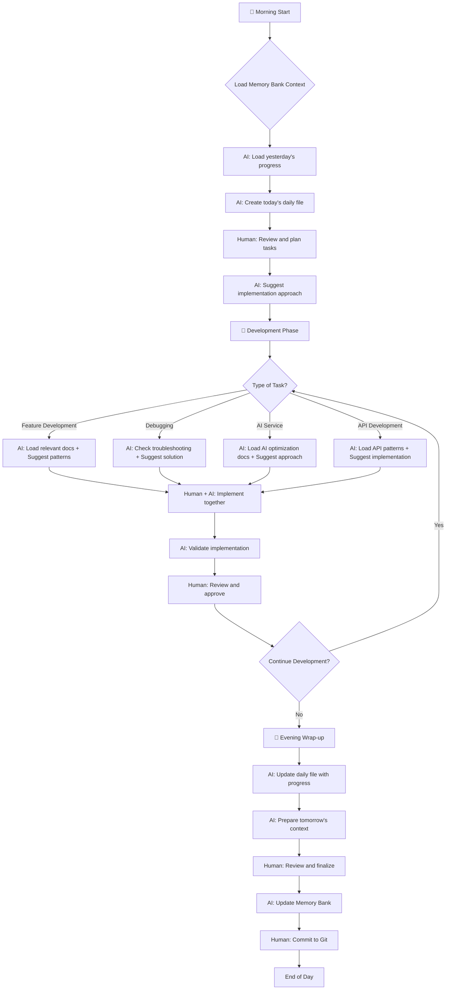

---

## 📚 **MEMORY BANK DOCUMENTATION WORKFLOW**

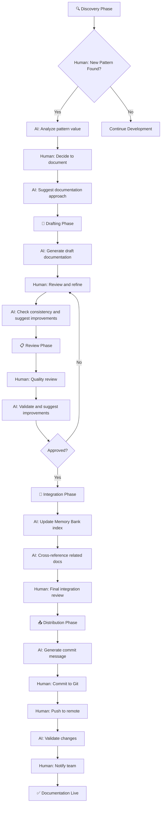

---

## 🔄 **TEAM SYNC WORKFLOW**

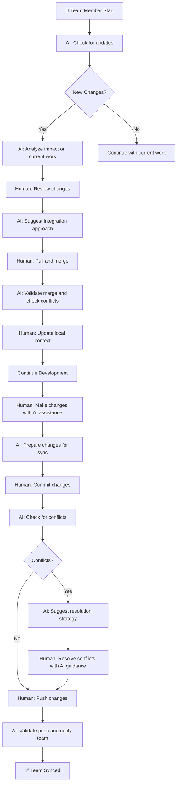

---

## 🎯 **HUMAN vs AI COLLABORATION DIAGRAM**

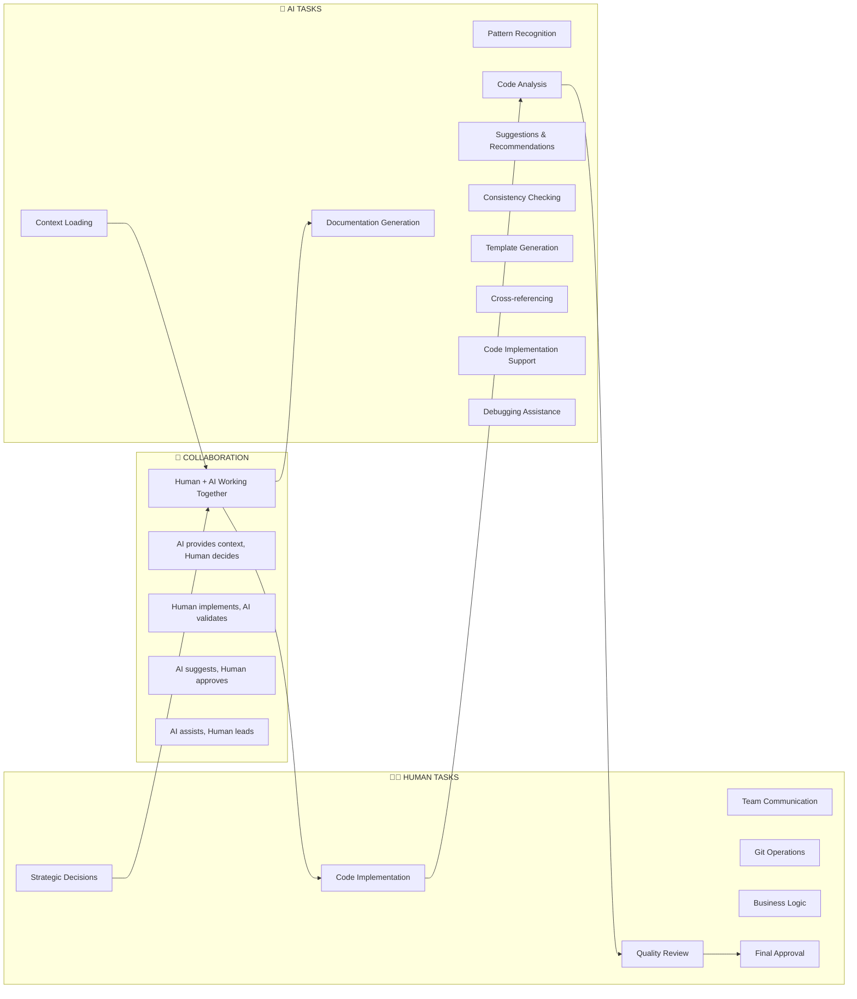

---

## 📋 **TASK RESPONSIBILITY MATRIX DIAGRAM**

```mermaid
graph TD
    subgraph "STRATEGIC TASKS"
        A[Strategic Planning] --> A1[Human: Final Decision]
        A1 --> A2[AI: Provide Context & Analysis]
    end
    
    subgraph "DEVELOPMENT TASKS"
        B[Code Implementation] --> B1[Human: Lead Implementation]
        B1 --> B2[AI: Assist with Patterns & Suggestions]
        B2 --> B3[Human + AI: Code Together]
        
        C[Feature Development] --> C1[AI: Load Documentation]
        C1 --> C2[AI: Suggest Approach]
        C2 --> C3[Human + AI: Implement Together]
    end
    
    subgraph "QUALITY TASKS"
        D[Code Review] --> D1[AI: Analyze Code Quality]
        D1 --> D2[Human: Final Review Decision]
        
        E[Testing] --> E1[AI: Generate Test Cases]
        E1 --> E2[Human: Review & Execute Tests]
    end
    
    subgraph "DOCUMENTATION TASKS"
        F[Documentation] --> F1[AI: Generate Draft]
        F1 --> F2[Human: Review & Refine]
        F2 --> F3[AI: Validate Consistency]
    end
    
    subgraph "MAINTENANCE TASKS"
        G[Memory Bank Updates] --> G1[AI: Generate Content]
        G1 --> G2[Human: Approve & Integrate]
        
        H[Git Operations] --> H1[AI: Prepare Commits]
        H1 --> H2[Human: Execute Git Commands]
    end
```

---

## 🚀 **IMPLEMENTATION PHASES DIAGRAM**

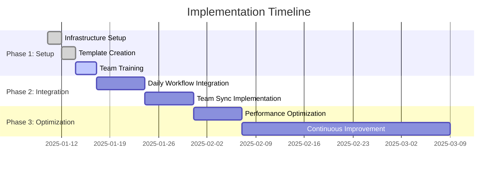

---

## 🎯 **DECISION TREE DIAGRAM**

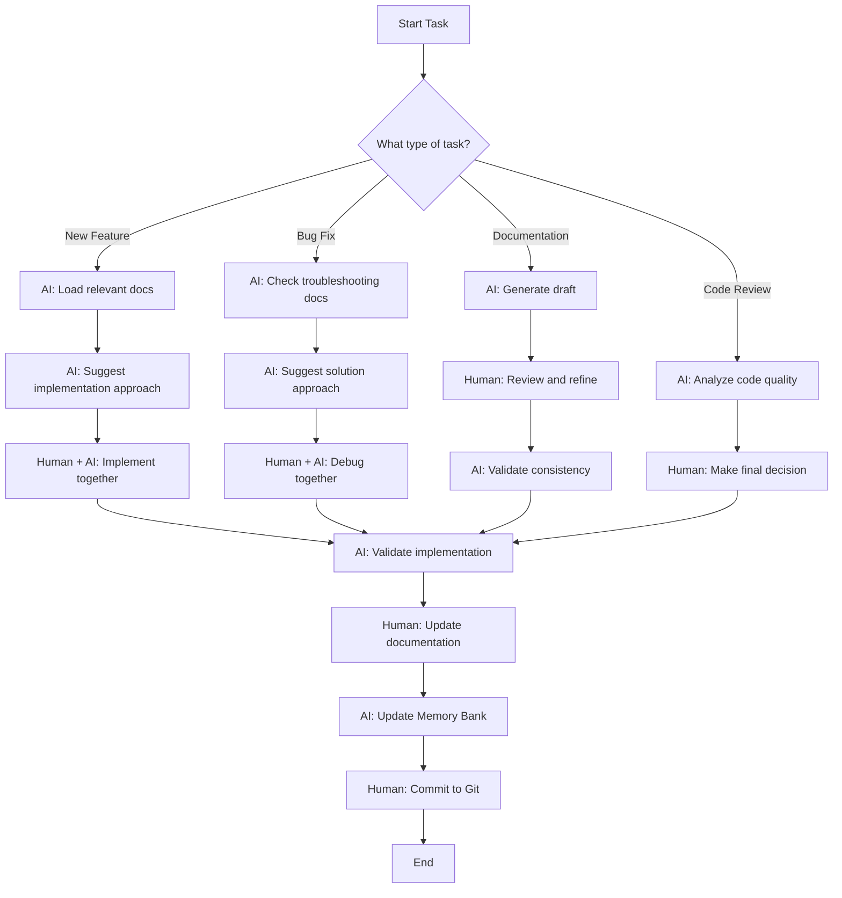

---

## 🚨 **TROUBLESHOOTING FLOW DIAGRAM**

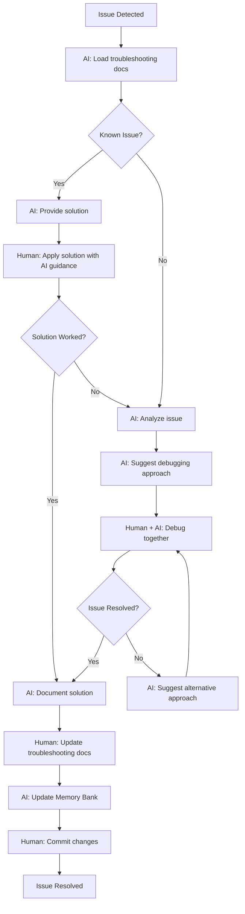

---

## 📈 **SUCCESS METRICS FLOW DIAGRAM**

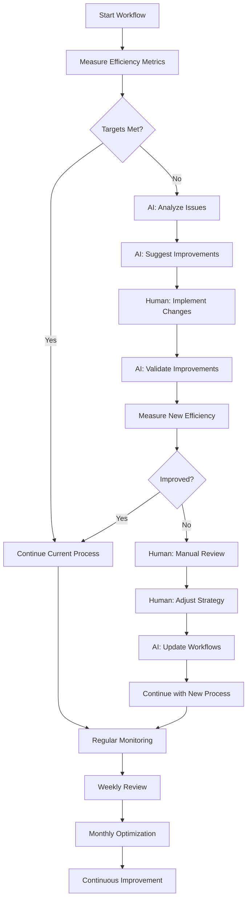

---

## 🔧 **CODE IMPLEMENTATION COLLABORATION DIAGRAM**

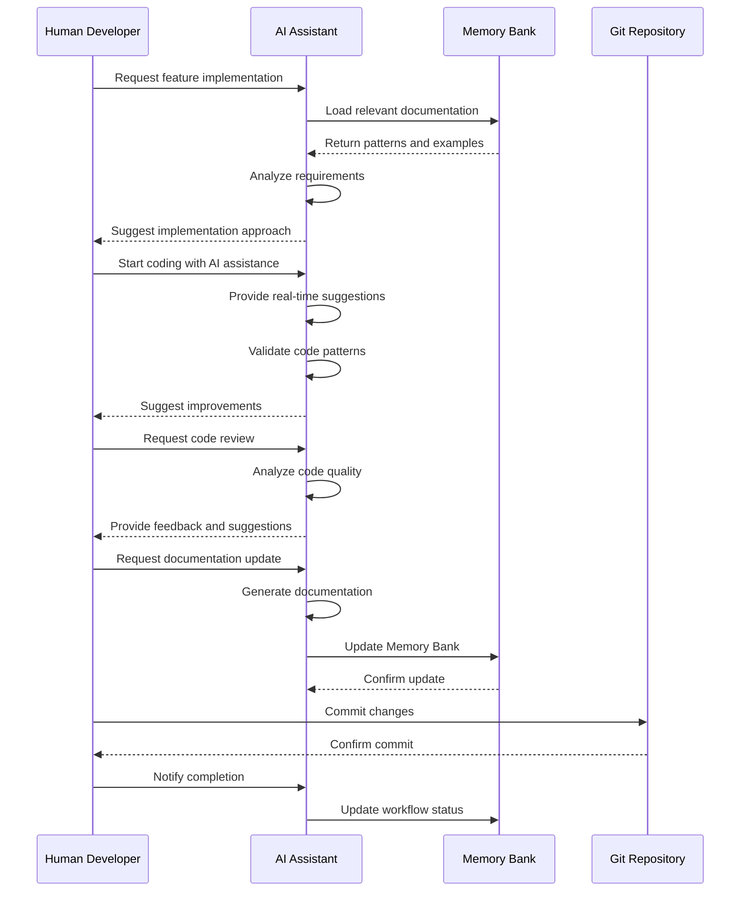

---

## 📊 **METRICS DASHBOARD DIAGRAM**

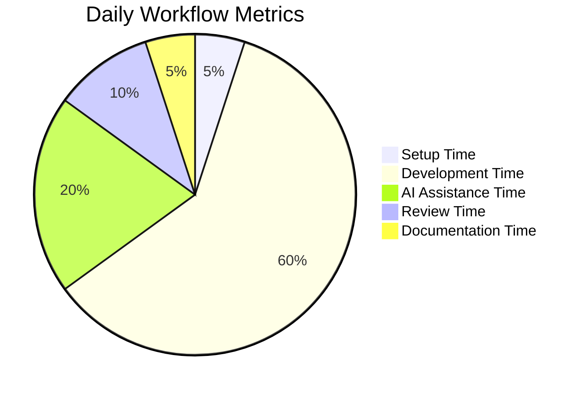

---

## 🎯 **QUICK REFERENCE DIAGRAM**

```mermaid
graph LR
    A[Morning Start] --> B[AI: Load Context]
    B --> C[Human: Plan Tasks]
    C --> D[AI: Suggest Approach]
    D --> E[Human + AI: Implement]
    E --> F[AI: Validate]
    F --> G[Human: Review]
    G --> H[AI: Update Memory Bank]
    H --> I[Human: Commit]
    I --> J[End Day]
```

---

**Last Updated**: 2025-01-10 | **Status**: Production Ready | **AI Implementation**: Ready
