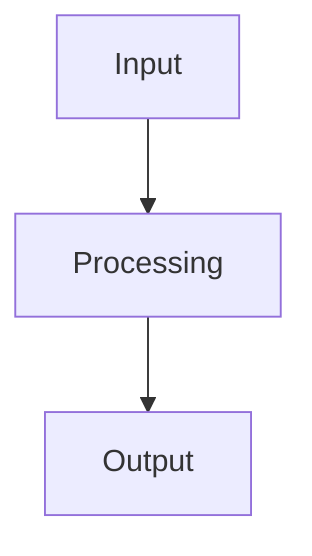

# 🔧 Task Context - [Task Name]

> **Created**: [YYYY-MM-DD] | **Last Updated**: [YYYY-MM-DD] | **Status**: [Status]

## 📝 Task Overview

### Description
[Detailed description of what needs to be done]

### Acceptance Criteria
- [ ] [Criterion 1]
- [ ] [Criterion 2]
- [ ] [Criterion 3]

### Definition of Done
- [ ] [DoD item 1]
- [ ] [DoD item 2]
- [ ] [DoD item 3]

## 🎯 Current Status

### Progress
- **Overall Progress**: [X]%
- **Current Phase**: [Phase name]
- **Next Milestone**: [Milestone description]

### Timeline
- **Started**: [Date]
- **Estimated Completion**: [Date]
- **Actual Completion**: [Date or TBD]

## 🧠 Technical Context

### Architecture Decisions
```typescript
// Key architectural decisions made
interface ExampleInterface {
  // Implementation details
}
```

### Code Structure
```
src/
├── [relevant folder structure]
└── [key files]
```

### Dependencies
- **Internal**: [List internal dependencies]
- **External**: [List external dependencies]
- **New Dependencies**: [List new dependencies added]

## 🔍 Implementation Details

### Key Components
1. **[Component 1]**: [Description]
2. **[Component 2]**: [Description]
3. **[Component 3]**: [Description]

### Data Flow


### API Endpoints
- `GET /api/endpoint1` - [Description]
- `POST /api/endpoint2` - [Description]

## 🐛 Issues & Solutions

### Current Issues
1. **[Issue 1]**: [Description] - [Status]
2. **[Issue 2]**: [Description] - [Status]

### Resolved Issues
- [x] **[Resolved Issue]**: [Solution]

### Known Limitations
- [Limitation 1]
- [Limitation 2]

## 🧪 Testing Strategy

### Test Cases
- [ ] [Test case 1]
- [ ] [Test case 2]
- [ ] [Test case 3]

### Test Data
```json
{
  "testData": "example"
}
```

### Manual Testing Steps
1. [Step 1]
2. [Step 2]
3. [Step 3]

## 📚 Resources & References

### Documentation
- [Link to relevant docs]
- [Link to API docs]

### Design References
- [Link to Figma designs]
- [Link to mockups]

### Code References
- [Link to similar implementations]
- [Link to related PRs]

## 🔄 Handover Notes

### For Next Developer
- [Important context 1]
- [Important context 2]
- [Code location to continue from]

### Pending Items
- [ ] [Pending item 1]
- [ ] [Pending item 2]

### Questions to Resolve
- [Question 1]
- [Question 2]

## 📊 Metrics & KPIs

### Performance Metrics
- **Response Time**: [X]ms
- **Memory Usage**: [X]MB
- **Error Rate**: [X]%

### Quality Metrics
- **Test Coverage**: [X]%
- **Code Complexity**: [X]
- **Maintainability Index**: [X]

---

**Last Updated**: [Timestamp] | **Next Review**: [Date]
