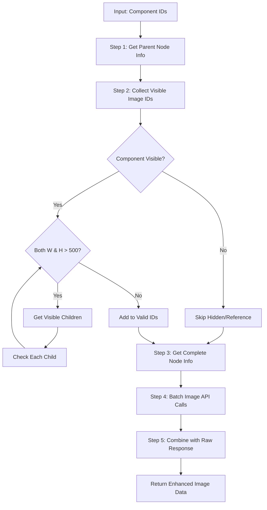

# 🎨 Figma Integration - Simplified Approach ⚡

## 🎯 Overview
Simplified Figma API integration with efficient 5-step processing for automated image extraction from visible components. **NEW**: Enhanced with complete raw Figma response data for perfect UI recreation.

## 🏗️ Simplified Architecture

### Core Components (3-Step Process)

```typescript
// Simplified Service Entry Point
FigmaService.getComponentImages()
├── Step 1: getNodeInfo() - Single API call for parent info
├── Step 2: collectVisibleImageIds() - Traverse children for visible IDs
├── Step 3: getBatchedImageUrls() - Batch image API calls
└── Return FigmaImageDto[]
```

## 🧠 Simplified Processing Logic ⚡

### 1. Single Parent Info Call
**Rule**: Get all parent component information in one API call

```typescript
// Step 1: Single API call for parent info
const parentNodeInfo = await this.getNodeInfo(figmaApi, fileId, componentIds);
// No recursive calls, no complex type checking
```

**Benefit**: Dramatically reduced API calls compared to recursive approach

### 2. Visible Component Collection
**Rule**: Only collect components visible on Figma screen (not references)

```typescript
// Step 2: Collect visible image IDs
const validImageIds = this.collectVisibleImageIds(parentNodeInfo);

// Logic:
// - Skip hidden components (visible === false)
// - Skip reference components (COMPONENT_SET, COMPONENT)
// - If component > 800px x 800px → get children
// - If component ≤ 800px → use directly
```

**Benefit**: Only process components that users can actually see
**NEW**: Complete raw Figma API response included for full UI recreation capability

### 3. Complete Node Info Fetch 🆕
Get comprehensive Figma data for all valid components:
```typescript
allValidNodeInfo = await getNodeInfo(figmaApi, fileId, validImageIds)
// Returns complete raw Figma response for each component
```

### 4. Batch Image Processing
**Rule**: Handle large numbers of images efficiently with batching

```typescript
// Step 4: Batch image API calls
const imageUrls = await this.getBatchedImageUrls(figmaApi, fileId, validImageIds, format, scale);

// Step 5: Enhanced result combination with raw Figma response
result = {
  componentId,
  imageUrl,
  width, height,
  figmaResponse: allValidNodeInfo[componentId] // Complete raw Figma data
}

// Logic:
// - Max 50 components per batch (Figma API limit)
// - 200ms delay between batches (rate limit protection)
// - Automatic batching if > 50 components
```

**Benefit**: Can handle hundreds of components without API limits

```typescript
// Priority 2: ComponentId Check (Applied ONLY for small components)
if (component_is_small && !node.componentId) {
  → Process children instead (không thể generate image cho node không có componentId)
  → Continue recursively until find nodes with componentId
} else if (component_is_small && node.componentId) {
  → Use original component for image extraction ✅
}
```

### 4. Simplified Collection Algorithm ⚡

```typescript
// No more recursion! Simple traversal
collectVisibleImageIds(parentNodeInfo) {
  validIds = []
  
  for (parentId, parentNode of parentNodeInfo) {
    if (isVisibleComponent(parentNode)) {
      if (isLargeComponent(parentNode)) {
        // Parent > 800x800px → get children
        childIds = getVisibleChildren(parentNode)
        validIds.push(...childIds)
      } else {
        // Parent is good size → use directly
        validIds.push(parentId)
      }
    } else {
      // Parent not suitable → try children
      childIds = getVisibleChildren(parentNode)
      validIds.push(...childIds)
    }
  }
  
  return [...new Set(validIds)] // Remove duplicates
}

getVisibleChildren(parentNode) {
  for (child of parentNode.children) {
    // Skip hidden: child.visible === false
    // Skip references: COMPONENT_SET, COMPONENT
    
    if (isLargeComponent(child)) {
      // Child large → get its children
      grandChildIds = getVisibleChildren(child)
      visibleIds.push(...grandChildIds)
    } else {
      // Child good size → add it
      visibleIds.push(child.id)
    }
  }
}
```

## 📊 Simplified Data Flow ⚡



### Simplified Flow Explanation:
1. **Step 1**: Single API call to get all parent component info
2. **Step 2**: Simple traversal to collect visible image IDs:
   - Skip hidden components (`visible === false`)
   - Skip reference components (`COMPONENT_SET`, `COMPONENT`)
   - If component > 500px (both dimensions) → get children
   - If component ≤ 500px (either dimension) → use directly
3. **Step 3**: Batch image API calls (max 50 per batch)
4. **Result**: Only visible, usable components returned

## 💾 Enhanced Data Structure

### Input
```typescript
componentIds: ["189639:111814", "189639:111815"]
```

### Output (Enhanced with Raw Figma Data!) ⚡
```typescript
FigmaImageDto[] = [
  {
    componentId: "189639:111815",
    imageUrl: "https://s3-alpha.figma.com/...",
    width: 60,
    height: 20,
    figmaResponse: {
      id: "189639:111815",
      name: "キャンセル",
      type: "TEXT",
      visible: true,
      locked: false,
      absoluteBoundingBox: {
        x: 10545,
        y: 17289,
        width: 60,
        height: 20
      },
      characters: "キャンセル",
      style: {
        fontFamily: "Hiragino Sans",
        fontSize: 14,
        fontWeight: 400,
        textAlignHorizontal: "CENTER",
        lineHeightPx: 20
      },
      fills: [{
        type: "SOLID",
        color: { r: 0.2, g: 0.2, b: 0.2 }
      }],
      constraints: {
        vertical: "CENTER",
        horizontal: "CENTER"
      },
      effects: [],
      children: [] // Complete hierarchy preserved
      // ... ALL other Figma API properties
    }
  },
  {
    componentId: "189639:111816", 
    imageUrl: "https://s3-alpha.figma.com/...",
    width: 10,
    height: 10,
    figmaResponse: {
      id: "189639:111816",
      name: "Icon",
      type: "VECTOR",
      visible: true,
      absoluteBoundingBox: { x: 10, y: 10, width: 10, height: 10 },
      fills: [{ type: "SOLID", color: { r: 0, g: 0, b: 0 } }],
      // ... Complete raw Figma response
    }
  }
]
```

## 🔧 Key Methods Deep Dive ⚡

### 1. `collectVisibleImageIds()` (SIMPLIFIED!)
**Purpose**: Collect all visible image IDs from parent nodes in one pass

```typescript
// Input: Parent node info from single API call
// Output: Array of valid image IDs
collectVisibleImageIds(parentNodeInfo: Record<string, FigmaNode>): string[] {
  const validIds: string[] = []
  
  for (const [parentId, parentNode] of Object.entries(parentNodeInfo)) {
    if (this.isVisibleComponent(parentNode)) {
      if (this.isLargeComponent(parentNode)) {
        // Parent > 800x800px → get children
        const childIds = this.getVisibleChildren(parentNode)
        validIds.push(...childIds)
      } else {
        // Parent good size → use directly
        validIds.push(parentId)
      }
    } else {
      // Parent not suitable → try children
      const childIds = this.getVisibleChildren(parentNode)
      validIds.push(...childIds)
    }
  }
  
  return [...new Set(validIds)] // Remove duplicates
}
```

**Benefits:**
- No recursive API calls
- Only visible components collected
- Reference components skipped
- Efficient single-pass processing

### 2. `isVisibleComponent()` (NEW!)
**Purpose**: Check if component is visible and suitable for image extraction

```typescript
// Input: Individual node
// Output: Boolean - is this component visible and usable?
isVisibleComponent(node: FigmaNode): boolean {
  // Must be visible (not hidden)
  if (node.visible === false) {
    return false
  }
  
  // Skip reference/definition components - only visible instances
  if (node.type === 'COMPONENT_SET' || node.type === 'COMPONENT') {
    return false
  }
  
  return true
}
```

**Key Rules:**
- `visible !== false` (undefined or true = visible)
- Skip `COMPONENT_SET` and `COMPONENT` (references only)
- Only actual visible instances on screen

### 3. `getVisibleChildren()` (SIMPLIFIED!)
**Purpose**: Get visible children IDs from a parent node (non-recursive)

```typescript
getVisibleChildren(parentNode: FigmaNode): string[] {
  if (!parentNode.children) return []
  
  const visibleIds: string[] = []
  
  for (const child of parentNode.children) {
    // Skip hidden children
    if (child.visible === false) continue
    
    // Skip reference/definition components
    if (child.type === 'COMPONENT_SET' || child.type === 'COMPONENT') continue
    
    if (this.isLargeComponent(child)) {
      // Child large → get its children
      const grandChildIds = this.getVisibleChildren(child)
      visibleIds.push(...grandChildIds)
    } else {
      // Child good size → add it
      visibleIds.push(child.id)
    }
  }
  
  return visibleIds
}
```

**Simplification:**
- No complex recursive API calls
- Simple traversal of existing data
- Clear visible/hidden logic

### 4. `getBatchedImageUrls()` (NEW!)
**Purpose**: Handle large numbers of image API calls efficiently

```typescript
getBatchedImageUrls(figmaApi, fileId, componentIds, format, scale) {
  const maxBatchSize = 50 // Figma API limit
  const allImages = {}
  
  // Split into batches if needed
  for (let i = 0; i < componentIds.length; i += maxBatchSize) {
    const batch = componentIds.slice(i, i + maxBatchSize)
    const batchImages = await this.getImageUrls(figmaApi, fileId, batch, format, scale)
    Object.assign(allImages, batchImages)
    
    // 200ms delay between batches
    if (i + maxBatchSize < componentIds.length) {
      await new Promise(resolve => setTimeout(resolve, 200))
    }
  }
  
  return allImages
}
```

**Benefits:**
- Respects Figma API limits (50 components max)
- Rate limit protection with delays
- Can handle hundreds of components

### 5. `isLargeComponent()` (SIMPLIFIED!)
**Purpose**: Simple size check for component decomposition

```typescript
isLargeComponent(node: FigmaNode): boolean {
  if (!node.absoluteBoundingBox) return false
  
  const { width, height } = node.absoluteBoundingBox
  return width > 500 && height > 500 // Both dimensions large
}
```

**Rule**: Components > 500px in both dimensions get decomposed
- Balanced approach - medium-large components get decomposed
- Better granularity for component extraction
- Good balance between performance and usability

## 🔍 Sample Figma Response Structure

### Node Structure (from figma_response.md)
```json
{
  "nodes": {
    "189639:111814": {
      "document": {
        "id": "189639:111814",
        "name": "Tag",
        "type": "FRAME",
        "absoluteBoundingBox": {
          "x": 10537,
          "y": 17288,
          "width": 76,
          "height": 22
        },
        "children": [
          {
            "id": "189639:111815",
            "name": "キャンセル",
            "type": "TEXT",
            "absoluteBoundingBox": {
              "x": 10545,
              "y": 17289,
              "width": 60,
              "height": 20
            }
          }
        ]
      }
    }
  }
}
```

## ⚡ Performance Optimizations

### 1. API Call Batching & Retry Logic
- Batch multiple component IDs in single API calls (max 10 per batch)
- **NEW**: Exponential backoff retry mechanism (2s, 4s, 8s delays)
- **NEW**: Intelligent error classification (retryable vs non-retryable)
- Cache node information to avoid duplicate requests
- Process children only when needed
- **NEW**: Rate limiting with 100ms delays between batches

### 2. Memory Management
- Use Set for deduplication
- Avoid circular references in recursive calls
- Clear temporary data structures
- **NEW**: Batch processing to prevent memory overload

### 3. Enhanced Error Handling
- **NEW**: Timeout increased from 30s to 60s for large operations
- **NEW**: Retry logic for timeout (ECONNABORTED), DNS (ENOTFOUND), rate limit (429), server errors (5xx)
- Graceful degradation for missing nodes
- Comprehensive logging for debugging
- **NEW**: Detailed error context with attempt tracking

## 🎛️ Configuration Options

### Current Settings ⚡ OPTIMIZED!
```typescript
// Size threshold for decomposition (BOTH dimensions must exceed)
const SIZE_THRESHOLD = 800; // pixels

// Image export settings
const DEFAULT_FORMAT = 'png';
const DEFAULT_SCALE = '2';
const API_TIMEOUT = 60000; // 60 seconds
```

### Customization Points
- **Size Threshold**: Adjustable per use case
- **Export Format**: png, jpg, svg, pdf
- **Scale Factor**: 1x, 2x, 4x for different resolutions
- **Component Types**: Filter by TEXT, VECTOR, FRAME, etc.

## 🔬 Testing Scenarios

### Scenario 1: FRAME with All Children (NEW!)
**Input**: FRAME node with multiple children components
**Expected**: ALL children processed directly (no visible filtering)
**Result**: All children IDs processed regardless of visible/type status

### Scenario 2: INSTANCE with Visible/Hidden Children (NEW!)
**Input**: INSTANCE node with mixed visible/hidden children
**Expected**: Only visible INSTANCE children processed
**Result**: Hidden children filtered out, only visible ones processed

### Scenario 3: Mixed Node Types Processing (NEW!)
**Input**: Array with FRAME, INSTANCE, and other types
**Expected**: Each type follows its specific logic
**Result**: FRAME → all children, INSTANCE → visible children, Others → normal logic

### Scenario 2.1: Small Node without ComponentId (NEW!)
**Input**: Node nhỏ (≤500px) không có componentId property 
**Expected**: Process children instead of current node (chỉ khi node đã nhỏ)
**Result**: Children được xử lý recursively cho đến khi tìm được nodes có componentId

### Scenario 2.2: Large Node without ComponentId (Priority Logic)
**Input**: Node lớn (>500px) không có componentId property
**Expected**: Process children vì size priority (không care componentId)
**Result**: Size check được ưu tiên, children được process bình thường

### Scenario 3: Small Component (≤800px either dimension)
**Input**: Single small component
**Expected**: Original component returned
**Result**: No decomposition occurs

### Scenario 4: Very Large Component (>800px both dimensions)
**Input**: Very large frame with children
**Expected**: Children components returned instead
**Result**: Recursive decomposition until components ≤800px in either dimension

### Scenario 5: Nested Large Components
**Input**: Large component with large children
**Expected**: Deep recursion until leaf components
**Result**: Multiple levels of decomposition

### Scenario 6: Mixed Sizes with Visible Filter
**Input**: Frame with mixed visible/hidden and various sizes
**Expected**: Only visible instances processed, then size-based decomposition applied
**Result**: Optimized visible component list

## 🚀 Usage Examples

### Basic Usage
```typescript
const images = await figmaService.getComponentImages(
  accessToken,
  fileId,
  ['component1', 'component2'],
  'png',
  '2'
);
```

### Type-Based Processing Flow (NEW!)

#### **FRAME Processing:**
```typescript
// 1. Input: FRAME ID với multiple children
['frame-id'] // FRAME containing various components

// 2. Processing: FRAME type detected → Process ALL children directly
// → NO FILTERING: All children.map(child => child.id)
// → Process: ['child1', 'child2', 'child3', 'child4'] (tất cả children)

// 3. Output: All children processed với individual priority logic
[
  { componentId: 'child1', name: 'Component1', imageUrl: '...' },
  { componentId: 'child2', name: 'Component2', imageUrl: '...' },
  { componentId: 'child3', name: 'Component3', imageUrl: '...' }
]
```

#### **INSTANCE Processing:**
```typescript
// 1. Input: INSTANCE ID với visible/hidden children
['instance-id'] // INSTANCE with mixed children

// 2. Processing: INSTANCE type detected → Filter visible children only
// → FILTERING APPLIED: filterVisibleInstances(node)
// → children: [visible=true, visible=false, visible=undefined]
// → filtered: [visible=true, visible=undefined] (visible=false excluded)

// 3. Output: Only visible children processed
[
  { componentId: 'visible-child1', name: 'VisibleComponent1', imageUrl: '...' },
  { componentId: 'visible-child3', name: 'VisibleComponent3', imageUrl: '...' }
  // hidden children excluded
]
```

### ComponentId Processing Flow (NEW!)
```typescript
// 1. Input: Node không có componentId (container/group node)
['container-node-id'] // Node chỉ là wrapper, không có componentId

// 2. Processing: ComponentId check applied
// → getNodeInfo(container-node-id) → { id: '...', componentId: undefined }
// → Check: !node.componentId → true
// → Action: Process children instead of current node

// 3. Children Processing: 
// → collectChildrenIds(node) → ['child1', 'child2', 'child3']
// → Process each child recursively
// → Continue until find nodes có componentId để có thể generate images

// 4. Final Result: Chỉ nodes có componentId
[
  { componentId: 'child1', imageUrl: '...', width: 100, height: 50 },
  { componentId: 'child3', imageUrl: '...', width: 80, height: 40 }
  // child2 không có componentId nên children của nó được process
]
```

### Advanced Processing Flow
```typescript
// 1. Input: Large component (800x600)
['large-component-id']

// 2. Processing: Decomposition occurs
// → Finds 3 children: ['child1', 'child2', 'child3']
// → Checks each child size
// → child2 is still large (600x400) → Further decomposition
// → Final: ['child1', 'child2a', 'child2b', 'child3']

// 3. Output: Multiple smaller, manageable components
[
  { componentId: 'child1', width: 200, height: 150, imageUrl: '...' },
  { componentId: 'child2a', width: 300, height: 200, imageUrl: '...' },
  { componentId: 'child2b', width: 250, height: 180, imageUrl: '...' },
  { componentId: 'child3', width: 100, height: 80, imageUrl: '...' }
]
```

---
*Implementation Date: Today*
*Status: Production Ready*
*Next Review: Performance optimization for large component trees*
