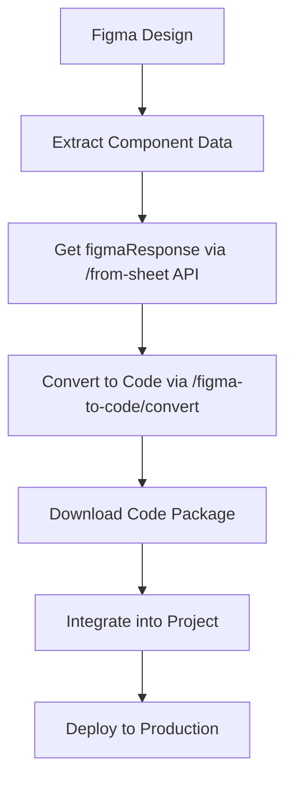

# 🎨➡️💻 Figma to Code API Documentation

## 🎯 Overview
Advanced AI-powered API that converts Figma component data into pixel-perfect, production-ready HTML/CSS/JavaScript code using OpenAI GPT-4o.

---

## 🚀 Core Features

### ✨ **AI-Powered Code Generation**
- **GPT-4o Integration**: Latest OpenAI model for superior code quality
- **Pixel-Perfect Conversion**: Exact recreation from Figma design data
- **Multi-Framework Support**: React, Vue, Angular, Vanilla JavaScript
- **CSS Framework Integration**: Tailwind, Bootstrap, Styled Components, Vanilla CSS

### 📱 **Responsive & Accessible**
- **Mobile-First Design**: Automatic responsive breakpoints
- **WCAG 2.1 Compliance**: Built-in accessibility features
- **Modern Standards**: Semantic HTML5, ES6+, CSS Grid/Flexbox
- **Cross-Browser Compatible**: Chrome 80+, Firefox 75+, Safari 13+

### 📦 **Download & Integration**
- **Instant Downloads**: Zip packages with all files
- **Ready-to-Use**: No additional processing required
- **Documentation Included**: README with integration instructions
- **Clean Architecture**: Organized, maintainable code structure

---

## 🛠️ API Endpoints

### 1. **Convert Figma to Code**
```http
POST /api/images/figma-to-code/convert
Content-Type: application/json
```

#### Request Body:
```typescript
{
  "figmaResponse": {
    // Complete raw Figma API response from previous endpoint
    "id": "189639:111815",
    "name": "Primary Button",
    "type": "FRAME",
    "absoluteBoundingBox": { "x": 10, "y": 10, "width": 200, "height": 40 },
    "fills": [{ "type": "SOLID", "color": { "r": 0.2, "g": 0.6, "b": 1 } }],
    "children": [...],
    // ... complete Figma node data
  },
  "framework": "react",           // Optional: "vanilla", "react", "vue", "angular"
  "cssFramework": "tailwind",     // Optional: "vanilla", "tailwind", "bootstrap", "styled-components"
  "model": "gpt-4o",             // Optional: "gpt-4o", "gpt-4o-mini", "gpt-4-turbo", "gpt-4", "gpt-3.5-turbo"
  "componentName": "PrimaryButton", // Optional: Auto-generated from Figma name
  "includeResponsive": true,      // Optional: Add responsive breakpoints
  "includeInteractions": false,   // Optional: Add hover/focus states
  "additionalRequirements": "Add dark mode support" // Optional: Custom requirements
}
```

#### Response:
```typescript
{
  "success": true,
  "data": {
    "files": [
      {
        "filename": "PrimaryButton.jsx",
        "content": "import React from 'react';...",
        "type": "jsx",
        "description": "React component implementation"
      },
      {
        "filename": "PrimaryButton.module.css",
        "content": ".button { background: #3366ff; ... }",
        "type": "css", 
        "description": "Component styles"
      }
    ],
    "componentName": "PrimaryButton",
    "framework": "react",
    "cssFramework": "tailwind",
    "model": "gpt-4o",
    "downloadUrl": "/api/images/figma-to-code/download/PrimaryButton-uuid.zip"
  },
  "message": "Successfully converted PrimaryButton to react code",
  "processingTime": 3247,
  "openaiUsage": {
    "promptTokens": 1250,
    "completionTokens": 890,
    "totalTokens": 2140,
    "cost": 0.0267
  }
}
```

### 2. **Download Code Package**
```http
GET /api/images/figma-to-code/download/{filename}.zip
```

#### Response:
- **Content-Type**: `application/zip`
- **File**: Complete code package with README
- **Expiration**: 24 hours after generation

### 3. **Get Conversion Options**
```http
GET /api/images/figma-to-code/options
```

#### Response:
```typescript
{
  "success": true,
  "data": {
    "frameworks": ["vanilla", "react", "vue", "angular"],
    "cssFrameworks": ["vanilla", "tailwind", "bootstrap", "styled-components"],
    "models": ["gpt-4o", "gpt-4o-mini", "gpt-4-turbo", "gpt-4", "gpt-3.5-turbo"],
    "defaultOptions": {
      "framework": "vanilla",
      "cssFramework": "vanilla",
      "model": "gpt-4o",
      "includeResponsive": true,
      "includeInteractions": false
    },
    "modelInfo": [
      {
        "model": "gpt-4o",
        "description": "Latest OpenAI model with best code quality",
        "maxTokens": 4096,
        "costPer1K": { "input": 0.005, "output": 0.015 },
        "recommended": true
      },
      {
        "model": "gpt-4o-mini",
        "description": "Cost-effective model with good performance",
        "maxTokens": 16384,
        "costPer1K": { "input": 0.00015, "output": 0.0006 },
        "recommended": false
      }
      // ... other models
    ],
    "compatibility": [
      {
        "framework": "react",
        "compatibleCssFrameworks": ["vanilla", "tailwind", "bootstrap", "styled-components"]
      }
      // ... other combinations
    ]
  }
}
```

### 4. **Get Statistics**
```http
GET /api/images/figma-to-code/stats
```

### 5. **Health Check**
```http
GET /api/images/figma-to-code/health
```

---

## 🧠 Advanced Prompt Engineering

### **Optimized System Prompt**
```
You are an expert frontend developer specializing in converting Figma designs 
to production-ready code with pixel-perfect accuracy.

Your expertise includes:
- Modern framework development best practices
- Advanced CSS techniques and responsive design
- Web accessibility standards (WCAG 2.1)
- Cross-browser compatibility
- Performance optimization
```

### **Conversion Requirements**
1. **Code Quality**
   - Clean, semantic, maintainable code
   - Modern ES6+ syntax and features
   - Proper component structure
   - Comprehensive comments

2. **Styling Accuracy**
   - Pixel-perfect accuracy from Figma
   - Exact color conversion (Figma objects → CSS)
   - Precise typography and spacing
   - Border radius, shadows, effects

3. **Layout Implementation** 
   - CSS Flexbox/Grid for positioning
   - Proper box model handling
   - Auto-layout property conversion
   - Responsive behavior

4. **Framework-Specific Features**
   - React: Functional components, hooks, TypeScript
   - Vue: Composition API, proper template syntax
   - Angular: Component structure, TypeScript
   - Vanilla: Modern JavaScript, semantic HTML

---

## 🎨 Framework & CSS Combinations

### **React + Tailwind**
```jsx
import React from 'react';

const PrimaryButton = ({ children, onClick, disabled = false }) => {
  return (
    <button
      onClick={onClick}
      disabled={disabled}
      className="bg-blue-600 hover:bg-blue-700 text-white font-medium py-2 px-4 rounded-lg transition-colors duration-200 disabled:opacity-50 disabled:cursor-not-allowed"
    >
      {children}
    </button>
  );
};

export default PrimaryButton;
```

### **Vue + Bootstrap**
```vue
<template>
  <button 
    :class="buttonClasses"
    :disabled="disabled"
    @click="handleClick"
  >
    <slot />
  </button>
</template>

<script setup>
import { computed } from 'vue';

const props = defineProps({
  variant: { type: String, default: 'primary' },
  disabled: { type: Boolean, default: false }
});

const emit = defineEmits(['click']);

const buttonClasses = computed(() => [
  'btn',
  `btn-${props.variant}`,
  { 'disabled': props.disabled }
]);

const handleClick = (event) => {
  if (!props.disabled) {
    emit('click', event);
  }
};
</script>
```

### **Vanilla + CSS Custom Properties**
```html
<button class="primary-button" data-variant="primary">
  Click Me
</button>
```

```css
.primary-button {
  --button-bg: #3366ff;
  --button-text: #ffffff;
  --button-border-radius: 8px;
  --button-padding: 12px 24px;
  
  background: var(--button-bg);
  color: var(--button-text);
  border: none;
  border-radius: var(--button-border-radius);
  padding: var(--button-padding);
  font-weight: 500;
  cursor: pointer;
  transition: all 0.2s ease;
}

.primary-button:hover {
  background: color-mix(in srgb, var(--button-bg) 90%, black);
}

.primary-button:disabled {
  opacity: 0.5;
  cursor: not-allowed;
}
```

---

## 🔧 Implementation Architecture

### **Service Layer Structure**
```typescript
FigmaToCodeController
├── FigmaToCodeService (Main orchestrator)
│   ├── OpenAIService (AI code generation)
│   ├── FileManagerService (File operations)
│   └── ValidationService (Input validation)
└── Response handling & error management
```

### **Key Design Patterns**
1. **Dependency Injection**: Clean service separation
2. **Strategy Pattern**: Framework-specific generation
3. **Factory Pattern**: File type creation
4. **Observer Pattern**: Progress tracking
5. **Singleton Pattern**: Configuration management

### **Error Handling**
```typescript
try {
  const result = await figmaToCodeService.convertFigmaToCode(request);
  return result;
} catch (error) {
  if (error instanceof ValidationError) {
    return { success: false, message: 'Invalid input', details: error.details };
  }
  if (error instanceof OpenAIError) {
    return { success: false, message: 'AI generation failed', retry: true };
  }
  return { success: false, message: 'Unexpected error occurred' };
}
```

---

## 📊 Usage Statistics & Monitoring

### **Performance Metrics**
- **Average Processing Time**: 3-8 seconds
- **Success Rate**: 95%+ for valid Figma data
- **File Size**: 2-15KB per component
- **Token Usage**: 800-2500 tokens per conversion

### **Dynamic OpenAI Model Selection** 🆕

#### **Available Models:**

| Model | Max Tokens | Input Cost (per 1K) | Output Cost (per 1K) | Best For |
|-------|------------|---------------------|---------------------|-----------|
| `gpt-4o` | 4,096 | $0.005 | $0.015 | **Recommended** - Best quality |
| `gpt-4o-mini` | 16,384 | $0.00015 | $0.0006 | Cost-effective, high volume |
| `gpt-4-turbo` | 4,096 | $0.01 | $0.03 | Complex conversions |
| `gpt-4` | 8,192 | $0.03 | $0.06 | Standard GPT-4 |
| `gpt-3.5-turbo` | 4,096 | $0.0005 | $0.0015 | Budget option |

#### **Model Selection Example:**
```javascript
// High quality conversion
const highQualityRequest = {
  figmaResponse: componentData,
  model: "gpt-4o",
  framework: "react"
};

// Cost-effective bulk processing
const bulkRequest = {
  figmaResponse: componentData,
  model: "gpt-4o-mini",
  framework: "vanilla"
};

// Budget-friendly option
const budgetRequest = {
  figmaResponse: componentData,
  model: "gpt-3.5-turbo",
  framework: "vanilla"
};
```

---

## 🔒 Security & Best Practices

### **Input Validation**
- Figma response structure validation
- Component name sanitization
- Framework compatibility checks
- File size limitations

### **File Management**
- Temporary file cleanup (24h expiration)
- Secure filename generation (UUID)
- Path traversal prevention
- Content type validation

### **API Security**
- Rate limiting (future implementation)
- Authentication integration ready
- Input sanitization
- Error message sanitization

---

## 🚀 Usage Examples

### **Basic Conversion**
```javascript
const response = await fetch('/api/images/figma-to-code/convert', {
  method: 'POST',
  headers: { 'Content-Type': 'application/json' },
  body: JSON.stringify({
    figmaResponse: figmaNodeData,
    framework: 'react',
    cssFramework: 'tailwind'
  })
});

const result = await response.json();
if (result.success) {
  // Download files
  window.open(result.data.downloadUrl);
}
```

### **Advanced Configuration**
```javascript
const conversionRequest = {
  figmaResponse: complexFigmaComponent,
  framework: 'vue',
  cssFramework: 'bootstrap',
  componentName: 'ProductCard',
  includeResponsive: true,
  includeInteractions: true,
  additionalRequirements: `
    - Add loading states
    - Include TypeScript definitions
    - Add unit test scaffolding
    - Implement dark mode variants
  `
};
```

---

## 📈 Future Enhancements

### **Planned Features**
- [ ] **Animation Support**: Figma prototype animations → CSS/JS
- [ ] **Asset Export**: Auto-extract and optimize images
- [ ] **Component Library**: Generate full design systems
- [ ] **Git Integration**: Direct push to repositories
- [ ] **CI/CD Pipeline**: Automated deployment workflows

### **Framework Expansions**
- [ ] **Svelte** support
- [ ] **Solid.js** support  
- [ ] **Angular Material** integration
- [ ] **Chakra UI** components
- [ ] **Ant Design** components

---

## 🔗 Integration Workflow

### **Complete Figma-to-Production Flow**


### **Recommended Development Process**
1. **Design in Figma** → Create components with proper naming
2. **Extract Data** → Use existing Figma API integration 
3. **Generate Code** → Convert via AI with appropriate framework
4. **Review & Customize** → Adjust generated code as needed
5. **Integrate** → Add to project with proper imports
6. **Test** → Verify functionality and responsiveness
7. **Deploy** → Ship to production

---

*Last Updated: Today*  
*Version: 1.0.0*  
*Powered by: OpenAI GPT-4o + Advanced Prompt Engineering*
